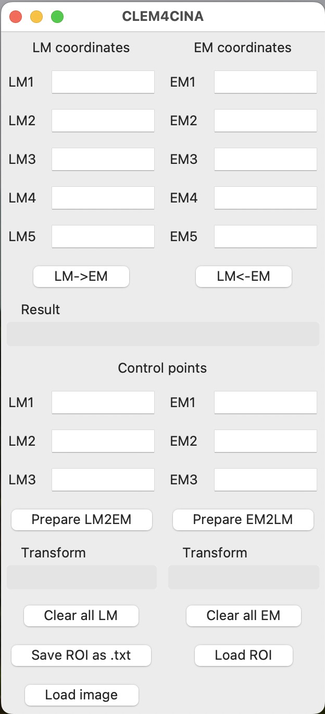

# CLEM4CINA
Simple GUI tool based on tkinter to enable coordinate transformation between TEM and LM images.

## Dependencies

* Python
* NumPy
* tkinter

## Usage
In a shell terminal, type:

```bash
./clem4cina.py
```

## Interface

The GUI looks like this:


